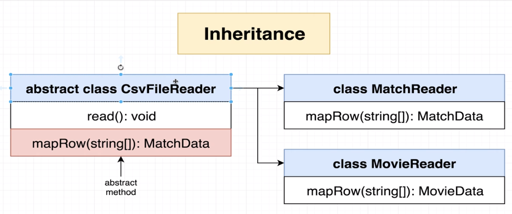
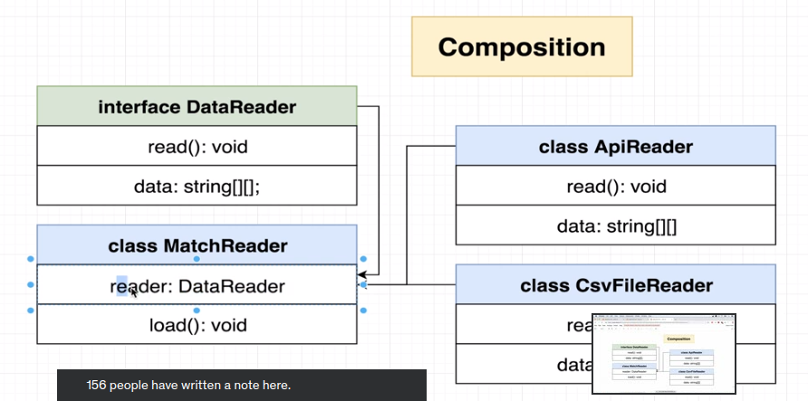
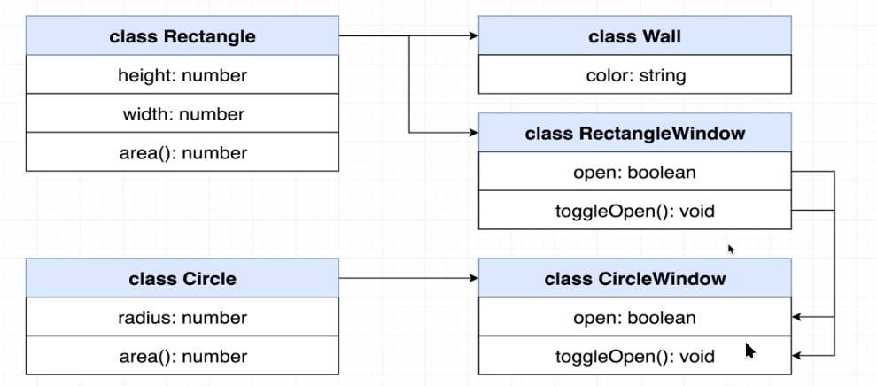
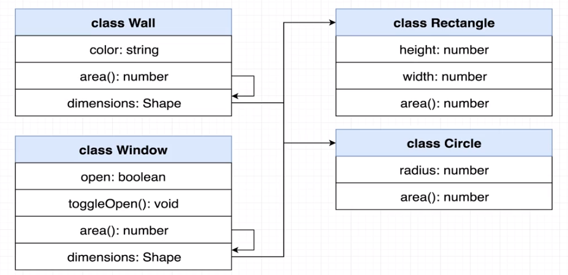
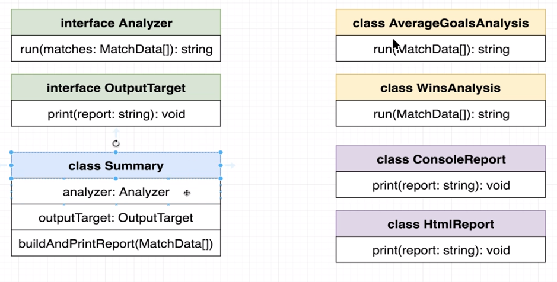

## How our project started:

```javascript
npm i nodemon --save-dev concurrently
tsc --init
Setup outdir and rootdir in tsconfig.json
Setup package.json 'scripts', the goal is to only use a single command to run 'concurrently' and 'nodemon'

```

### Using 'Generics' to reference a reusable data type

- Like function arguments, but for types in class/function definitions
- Allows us to define the type of a property/argument/return value at a future point
- Used heavily when writing reusable code

```javascript
// TypeOfData (a Generic example) is an argument similar to a function argument, so when we pass an argument to HoldAnything
// it will be passed as an argument(line 25) which is of type 'number'
class HoldAnything<TypeOfData> {
  data: TypeOfData;
}

const holdNumber = new HoldAnything<number>();
holdNumber.data = 123;

const holdstring = new HoldString<string>();
holdString.data = 'abcdfeg'

// Another Example

// Repeating a function but has the same logic but different type (not ideal)

class ArrayOfNumber {
  constructor(public collection: number[]){}

  get(index: number): number {
    return this.collection[index]
  }
}

class ArrayOfStrings {
  constructor(public collection: string[]){}

  get(index: number): string {
    return this.collection[index]
  }
}

// Use Generics
class ArrayOfAnytrhing<T> {

  constructor(public collection: T[]){}

  get(index: number): T{
    return this.collection[index]
  }
}

new ArrayOfAnything<string>(["a","b","c"]);    // if we remove '<string>' or '<number>'', the class will still work because of type 'inference'
new ArrayOfAnything<number>([1,2,3]);

```

#### Example of generics with functions

```javascript
// Notice that these two functions has the same logic but different type 'string' and 'number' array
function arrayWithNumbers(arr: number[]): void {
  for (let i = 0; i < arr.length; i++) {
    console.log(arr[i]);
  }
}

function arrayWithStrings(arr: string[]): void {
  for (let i = 0; i < arr.length; i++) {
    console.log(arr[i]);
  }
}

// To avoid repeated code, lets use generics
function arrayWithAnything<T>(arr: T[]): void {
  for (let i = 0; i < arr.length; i++) {
    console.log(arr[i]);
  }
}

arrayWithAnything < string > ["a", "b", "c"];
arrayWithAnything < number > [1, 2, 3];
```

#### Generic Constraints

```javascript
// The objective is to call 'Car' and 'House' and use 'print' function
class Car {
  print() {
    console.log("I am a car");
  }
}

class House {
  print() {
    console.log("I am a house");
  }
}
// The issue?
// If our function 'printHousesOrCars([1,2,3,4])' passes an arguments that are number, this don't have a 'print' method on it.

// To fix?
// Lets use 'interface' to ensure that our arguments contains a 'print' function that returns nothing('void')

interface Printable {
  print(): void;
}

// What happen on 'T extends Printable'?
// This is telling that what we have in type 'T' will have all the properties that we defined in 'Printable'
function printHousesOrCars<T extends Printable>(arr: T[]): void {
  for (let i = 0; i < arr.length; i++) {
    arr[i].print();
  }
}

// Will work because it satisfies the 'Printable' interface
printHousesOrCars<House>([new House(), new House()])
printHousesOrCars<Car>([new Car(), new Car()])

// Will not work because this argument doesn't satisfy that 'Printable' interface which should have a 'print()' function
printHousesOrCars([1,2,3,4])

```

## Inheritance vs Composition

### Inheritance

- Characterized by an 'is a' relationship bertween two classes (so in our image below, MatchReader is a CsvFileReader because all the properties of the parent class 'CsvFileReader' also belongs to 'MatchReader')
- the idea is we have a 'parent' class that contains the core functionality and extend the class to a 'child' class and customized the behavior
  

### Composition

- Characterized by a 'has a' relationship between two classes (so in our image below, MatchReader 'has a' relationship to CsvFileReader and ApiReader)
- in our example, we are referencing a class(MatchReader using interface 'DataReader') and any classes that will use 'MatchReader' should follow these structure
- in our example, we delegated the actual reading of data to outside classes(CSVFileReader). In this part, we can structure our data in a separate class(for example 'read' function) as long as it follows the structure mentioned in the other class(CSVFileReader) and we can also restructure how the data is prepared in the other class(for example, class APIReader 'read' function) but still returns the same format. This is possible since this is referenced in our "inference" property so we can easily swap the 'read' function
  

## More Inheritance vs Composition Example

#### Inheritance



#### Composition



### Refactoring index.ts



- we will have a class 'Summary' that will reference to 'Analyzer' interface in the analyzer property.
- we will also have a outputTarget property that will reference to 'OutputTarget' interface

### Summary

- We created an **enum**(CarVehicle.ts) that will present the values that are closely related, this only gives developers/engineers that these are the fields
- We created a **tuple**(VehicleData.ts) that presents the structure of our row but we did this manually
- We used **generics**(refactor-1/MatchReader.ts) to configure that type definition defined in our class(see that we extends our class to CSVFileReader<VehicleData>)
- We used **composition**(MatchReader.ts -> **interface DataReader**) is delegated to load the actual loading of data from outside (API, CSV file, etc)
